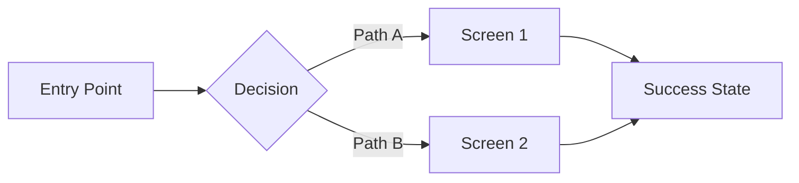

# Design Spec Generator — UI/UX & Technical Design Documents

## Trigger
`/design_spec` or when user says "design spec", "UI spec", "UX spec", "wireframe spec", "technical design", "design doc", "system design", "HLD", "LLD", "Figma brief"

## Purpose
Generate structured design specification documents for features — covering UI/UX flows, component breakdowns, interaction patterns, state diagrams, and visual specs. Outputs design-ready markdown with embedded Mermaid diagrams, component trees, and Figma handoff briefs. Bridges the gap between PRD and engineering implementation.

## Actions

### `ui` (default)
Generate a UI/UX design specification:

1. **Identify scope:**
   - Read the source PRD if referenced (`/prd_writer` output)
   - Ask: Feature name, target platform (web/desktop/mobile), key screens
   - Check `Charter_Areas.md` for architecture context

2. **Generate design spec sections:**
   - User journey map (Mermaid flowchart)
   - Screen inventory with component breakdown
   - Interaction patterns (hover, click, keyboard, accessibility)
   - State diagram (empty, loading, populated, error, edge cases)
   - Visual tokens (colors, typography, spacing, elevation)
   - Responsive breakpoints
   - Accessibility requirements (WCAG 2.1 AA minimum)

3. **Output format:** Markdown with embedded Mermaid diagrams
4. **Save:** `projects/[area]/Design_Spec_[Title]_[Date].md`

### `technical`
Generate a technical design document (HLD/LLD):

1. **Gather context:**
   - Source PRD or feature description
   - Existing architecture from `Charter_Areas.md`
   - Related ADO items for scope understanding

2. **Generate sections:**
   - Architecture overview (Mermaid C4 or component diagram)
   - API contract (endpoints, request/response schemas)
   - Data model (entity relationship diagram in Mermaid)
   - Sequence diagrams for key flows
   - Error handling matrix
   - Performance requirements and SLAs
   - Security considerations
   - Testing strategy
   - Migration plan (if modifying existing system)
   - Rollback plan

3. **Output:** Markdown with Mermaid diagrams
4. **Save:** `projects/[area]/Tech_Design_[Title]_[Date].md`

### `figma_brief`
Generate a Figma design handoff brief:

1. **Create a structured brief for designers:**
   - Feature context and user problem
   - User flow (numbered steps with decision points)
   - Component inventory (existing vs. new components needed)
   - State matrix (every screen x every state)
   - Content strings / copy requirements
   - Design tokens to use (from design system)
   - Accessibility notes
   - Edge cases to design for
   - Reference screenshots or competitive examples (described)

2. **Output:** Markdown optimized for pasting into Figma comments or design tickets
3. **Save:** `projects/[area]/Figma_Brief_[Title]_[Date].md`

### `review`
Review an existing design spec:

1. Score against checklist:
   - [ ] All user states covered (empty, loading, success, error, edge)
   - [ ] Accessibility addressed (keyboard nav, screen reader, contrast)
   - [ ] Responsive behavior defined
   - [ ] Error messages specified (not just "error occurred")
   - [ ] Loading states defined (skeleton, spinner, progressive)
   - [ ] Edge cases listed (0 items, 1000 items, long text, special chars)
   - [ ] Data flow documented (where data comes from, caching, refresh)
   - [ ] Component reuse identified (don't reinvent existing components)
2. Output: Score (X/8) + specific gaps

## Output Format

### UI Design Spec
```markdown
# Design Spec: [Feature Title]

| Field | Value |
|-------|-------|
| **Author** | [Name] |
| **Date** | [Today] |
| **Status** | Draft |
| **PRD** | [Link to PRD if exists] |
| **Platform** | Web / Desktop / Mobile |

## User Journey



## Screen Inventory

### Screen 1: [Name]
**Purpose:** [What the user accomplishes here]

| Component | Type | States | Notes |
|-----------|------|--------|-------|
| Header | Existing | Default | Reuse AppHeader |
| Data Table | New | Empty, Loading, Populated, Error | Sortable, filterable |
| Action Button | Existing | Default, Hover, Disabled, Loading | Primary style |

### State Matrix

| Screen | Empty | Loading | Populated | Error | Edge Case |
|--------|-------|---------|-----------|-------|-----------|
| List View | ✅ | ✅ | ✅ | ✅ | 1000+ items |
| Detail View | N/A | ✅ | ✅ | ✅ | Long title |

## Interaction Patterns
[Hover behaviors, transitions, animations, keyboard shortcuts]

## Accessibility
- Keyboard navigation: [Tab order, focus management]
- Screen reader: [ARIA labels, live regions]
- Color contrast: [WCAG AA ratios]

## Visual Tokens
| Token | Value | Usage |
|-------|-------|-------|
| Primary Color | #0078D4 | CTA buttons, links |
| Surface | #FAFAFA | Card backgrounds |
| Text Primary | #333333 | Body text |
| Spacing Unit | 8px | Base grid |

## Open Design Questions
- ❓ [Question for design review]
```

## Context Sources
1. `00_Daily_Intelligence/Knowledge_Base/Charter_Areas.md` — Architecture context
2. `00_Daily_Intelligence/Knowledge_Base/Processes_Reference.md` — Technical patterns
3. Related PRD files in project folders
4. `00_Daily_Intelligence/Knowledge_Base/Goals.md` — Priority alignment

## MCP Integration
- **Azure DevOps MCP** — Link design specs to work items
- **GitHub MCP** — Reference related issues or PRs

## Anti-Patterns
- ❌ Don't skip the state matrix — every screen needs every state considered
- ❌ Don't ignore accessibility — it's not optional, it's a design requirement
- ❌ Don't write implementation code in a design spec — describe behavior, not code
- ❌ Don't create specs without user context — always ground in the user problem
- ❌ Don't assume a design system exists — ask about component libraries first

## Cross-Skill References
| Need | Skill |
|------|-------|
| Write the PRD first | `/prd_writer` |
| Create ADO items from design spec | `/delegate_ado` |
| Generate wireframe deck | `/m365_doc_generator ppt` |
| Review spec quality | `/deep_review` |
