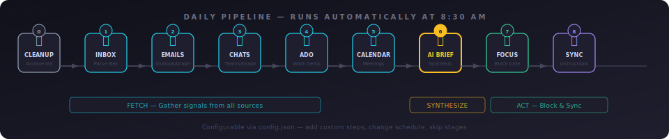
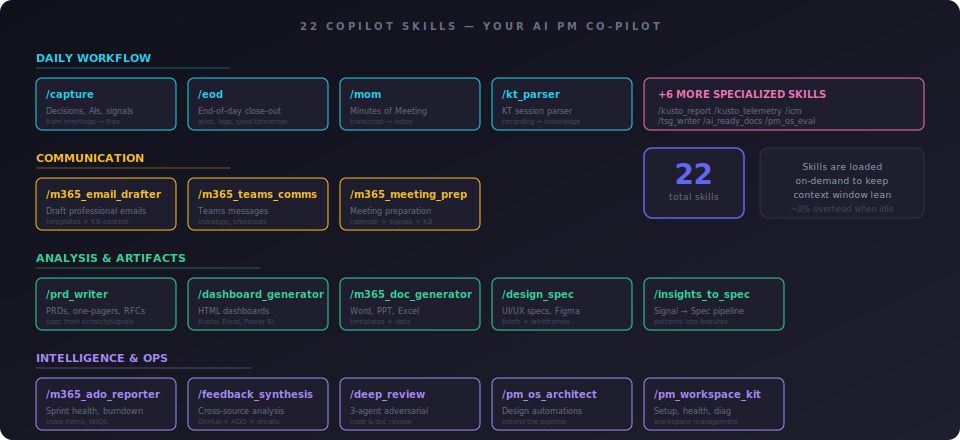
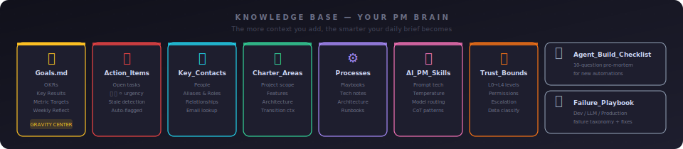
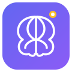

<p align="center">
  
</p>

<p align="center">
  <a href="#-quick-start">Quick Start</a> ·
  <a href="#-how-it-works">How It Works</a> ·
  <a href="#-skills">Skills</a> ·
  <a href="#-knowledge-base">Knowledge Base</a> ·
  <a href="#-demo-artifacts">Demos</a> ·
  <a href="#-architecture">Architecture</a> ·
  <a href="docs/SETUP.md">Setup Guide</a>
</p>

---

## The Problem

Product Managers juggle emails, calendars, ADO boards, meeting notes, action items, partner comms, and strategic docs — across 5+ tools every day. Context is scattered. Priorities are buried. The first 45 minutes of every morning is spent *figuring out what to focus on*.

## The Solution

**Brain OS** is a local-first, AI-powered PM workspace that auto-fetches your daily signals, generates an intelligent brief, serves a Command Center dashboard, and integrates with GitHub Copilot as your AI PM co-pilot via 22 custom skills.

All data stays on your machine. No cloud dependency. No subscription.

---

## 🚀 Quick Start

<table>
<tr><td>

### Prerequisites

| Tool | Version | Notes |
|------|---------|-------|
| Windows | 10/11 | macOS/Linux: partial — see [Setup Guide](docs/SETUP.md) |
| VS Code | Latest | With GitHub Copilot extension |
| Python | 3.10+ | For pipeline scripts and portal |
| PowerShell | 5.1+ | Built into Windows |
| Azure CLI | Latest | `az login` for signals |

</td></tr>
</table>

```bash
# 1. Clone & Setup
git clone https://github.com/YOUR_USERNAME/brain-os.git
cd brain-os
python -m venv .venv && .venv\Scripts\activate
pip install -r _Automation\requirements.txt

# 2. Configure
copy _Automation\config.sample.json _Automation\config.json
# Edit config.json with your name, email, projects, ADO org

# 3. Authenticate
az login

# 4. Run your first pipeline
.\_Automation\daily_orchestrator.ps1 -Force

# 5. Launch Command Center
python _Automation\serve_artifacts.py
# → http://localhost:8765
```

Then open the folder in VS Code — Copilot automatically loads your skills and knowledge base.

---

## ⚡ How It Works

<p align="center">
  
</p>

The pipeline runs automatically every weekday morning. Each step is independent and skippable:

| Phase | Steps | What Happens |
|-------|-------|-------------|
| **Fetch** | Inbox → Emails → Chats → ADO → Calendar | Gather raw signals from all your tools into markdown files |
| **Synthesize** | AI Brief | Copilot cross-references signals + Knowledge Base → priorities, prep, actions |
| **Act** | Focus Blocks → Sync | Block calendar time for top priorities, regenerate Copilot context |

The portal at `localhost:8765` serves everything in a Fluent 2-themed dashboard with dark/light mode — KPIs, calendar, action items, project tiles, daily brief, and file search.

---

## 🧠 Skills

<p align="center">
  
</p>

Skills are markdown instruction files that turn GitHub Copilot into a domain-specific PM assistant. They load on-demand — zero context overhead when idle.

<details>
<summary><strong>Full Skills Reference</strong> (click to expand)</summary>

### Daily Workflow
| Skill | Trigger | Description |
|-------|---------|-------------|
| Quick Capture | `/capture` | Extract decisions, AIs, signals from meetings → route to correct files |
| End of Day | `/eod` | Interactive close-out → review tasks, log wins, seed tomorrow |
| MOM Generator | `/mom` | Minutes of Meeting from transcripts or live notes |
| KT Session Parser | `/kt_parser` | Parse KT sessions into structured knowledge artifacts |

### Communication
| Skill | Trigger | Description |
|-------|---------|-------------|
| Email Drafter | `/m365_email_drafter` | Draft professional emails with KB context + templates |
| Teams Comms | `/m365_teams_comms` | Standups, announcements, escalations, shoutouts |
| Meeting Prep | `/m365_meeting_prep` | Auto-generate prep docs from calendar + signals + KB |

### Analysis & Artifacts
| Skill | Trigger | Description |
|-------|---------|-------------|
| PRD Writer | `/prd_writer` | Full PRDs, one-pagers, RFCs from scratch or signals |
| Dashboard Generator | `/dashboard_generator` | Interactive HTML dashboards, Kusto, Excel, Power BI |
| Doc Generator | `/m365_doc_generator` | Generate Word/PPT/Excel from templates and data |
| Design Spec | `/design_spec` | UI/UX specs, technical design docs, Figma briefs |
| Insights to Spec | `/insights_to_spec` | Convert signal patterns into structured feature specs |

### Intelligence & Ops
| Skill | Trigger | Description |
|-------|---------|-------------|
| ADO Reporter | `/m365_ado_reporter` | Sprint health, epic burndown, stale item detection |
| Feedback Synthesis | `/feedback_synthesis` | Cross-source feedback analysis → unified themes |
| Deep Review | `/deep_review` | Adversarial review with 3 parallel agents |
| PM OS Architect | `/pm_os_architect` | Design and extend your automation pipeline |
| PM OS Eval | `/pm_os_eval` | Score and regression-test daily brief quality |
| Workspace Kit | `/pm_workspace_kit` | Setup wizard, portal launch, health check |

### Specialized
| Skill | Trigger | Description |
|-------|---------|-------------|
| Kusto Report | `/kusto_report` | Run KQL queries, generate HTML reports |
| Kusto Telemetry | `/kusto_telemetry` | Azure Data Explorer analysis with table catalog |
| IcM Integration | `/icm` | Incident management queries and on-call schedules |
| TSG Writer | `/tsg_writer` | Troubleshooting guides with required sections |
| AI-Ready Docs | `/ai_ready_docs` | Format documentation for AI consumption |
| Delegate ADO | `/delegate_ado` | Create ADO work items from plans |

</details>

> **See example outputs →** [`docs/demos/`](docs/demos/) ·  **[Live Demo Gallery](https://kustonaut.github.io/brain-os/)**

---

## 📚 Knowledge Base

<p align="center">
  
</p>

Every file in `00_Daily_Intelligence/Knowledge_Base/` feeds into the AI brief generator and Copilot skills. The richer your knowledge base, the more contextual and accurate your outputs become.

---

## 🎨 Demo Artifacts

Open these directly in your browser — no setup required. All content uses fictional data.

<table>
<tr>
<td align="center" width="20%">
  <a href="https://kustonaut.github.io/brain-os/demos/demo_dashboard_sprint_health.html"><strong>Sprint Dashboard</strong></a><br/>
  <sub>Interactive HTML with KPIs, burndown, risk heatmap, dark/light toggle</sub><br/>
  <sub><code>/dashboard_generator</code></sub>
</td>
<td align="center" width="20%">
  <a href="https://kustonaut.github.io/brain-os/demos/demo_command_center.html"><strong>Command Center</strong></a><br/>
  <sub>Static demo of the localhost:8765 portal with full layout</sub><br/>
  <sub><code>Portal</code></sub>
</td>
<td align="center" width="20%">
  <a href="https://kustonaut.github.io/brain-os/demos/demo_prd_notification_center.html"><strong>PRD: Notifications</strong></a><br/>
  <sub>Full PRD with problem, metrics, acceptance criteria, risks</sub><br/>
  <sub><code>/prd_writer</code></sub>
</td>
<td align="center" width="20%">
  <a href="https://kustonaut.github.io/brain-os/demos/demo_mom_sprint_planning.html"><strong>MOM: Sprint Plan</strong></a><br/>
  <sub>Minutes with decisions table, AIs, parking lot</sub><br/>
  <sub><code>/mom</code></sub>
</td>
<td align="center" width="20%">
  <a href="https://kustonaut.github.io/brain-os/demos/demo_daily_brief.html"><strong>Daily Brief</strong></a><br/>
  <sub>AI-generated intelligence with priorities, OKRs, focus blocks</sub><br/>
  <sub><code>Pipeline</code></sub>
</td>
</tr>
</table>

---

## 🏗️ Architecture

For detailed diagrams, see the [Architecture Guide](docs/ARCHITECTURE.md) — includes system overview, pipeline flow, skills binding, and artifact generation diagrams.

<details>
<summary><strong>Folder Structure</strong> (click to expand)</summary>

```
brain-os/
├── _Automation/           ← Pipeline scripts + config
│   ├── config.json        ← YOUR identity, projects, settings
│   ├── daily_orchestrator.ps1  ← Master pipeline (10 steps)
│   ├── generate_brief.ps1      ← AI brief generator
│   ├── serve_artifacts.py      ← Command Center portal server
│   ├── fetch_emails.ps1        ← Outlook signal fetcher
│   ├── fetch_calendar.ps1      ← Calendar signal fetcher
│   ├── fetch_ado.ps1           ← ADO work item fetcher
│   ├── fetch_chats.ps1         ← Teams chat fetcher
│   ├── graph_helpers.ps1       ← MS Graph API helpers
│   ├── parse_inbox.ps1         ← File parser & router
│   ├── block_calendar.ps1      ← Focus time blocker
│   ├── cleanup.ps1             ← Signal/brief archival
│   ├── sync_instructions.ps1   ← Auto-sync copilot-instructions.md
│   └── weekly_snapshot.ps1     ← Weekly signal aggregation
│
├── .vscode/
│   ├── tasks.json         ← VS Code task shortcuts
│   └── skills/            ← 22 GitHub Copilot skills
│
├── 00_Daily_Intelligence/
│   ├── Knowledge_Base/    ← Goals, contacts, action items, processes
│   ├── Daily_Briefs/      ← AI-generated daily briefs
│   ├── Signals/           ← Raw signal files (emails, ADO, calendar, chats)
│   ├── Meeting_Prep/      ← Generated meeting prep docs
│   └── Weekly_Snapshots/  ← Friday aggregations
│
├── _Inbox/                ← Drop files here → auto-routed to projects
│
├── projects/              ← Your project folders (create per charter area)
│
└── docs/                  ← Setup guide, architecture, skill reference, demos
```

</details>

### Design Principles

| Principle | What It Means |
|-----------|--------------|
| **Local-first** | All data on your machine. No cloud storage of personal data. |
| **Config-driven** | One JSON file defines your entire workspace identity. |
| **Dual-mode signals** | COM (Windows Outlook) with Graph API fallback. |
| **Skill-based AI** | Copilot skills loaded on-demand, not always in context. |
| **Trust boundaries** | Every script has a trust level (read-only → communicate). |
| **Eval-driven** | Brief quality scored against a rubric. Changes require regression tests. |

---

## 🔧 AI Engineering

Brain OS applies production AI engineering practices:

| Practice | Implementation |
|----------|---------------|
| Temperature routing | `config.json` maps task types → temperatures (0.1 data, 0.5 comms, 0.8 creative) |
| CoT + Step-Back | System prompts include chain-of-thought and step-back reasoning |
| Eval suite | Golden test cases for brief generation with 5-dimension scoring |
| Failure taxonomy | Dev / LLM / Production classification with recovery playbook |
| Trust levels | L0 (read) → L4 (external API) with escalation triggers |
| Pre-mortem gate | Every new automation passes a 10-question checklist |

---

## ⚙️ Customization

<details>
<summary><strong>Add a new project</strong></summary>

1. Add to `config.json` → `projects[]`
2. Create a folder in `projects/` (e.g., `projects/my-project/`)
3. Add routing keywords to `config.json` → `charter_patterns[]`
4. Run `sync_instructions.ps1` to update Copilot context
</details>

<details>
<summary><strong>Create a new skill</strong></summary>

1. Create `.vscode/skills/my_skill.md` — see [Skills Guide](docs/SKILLS_GUIDE.md) for template
2. Register in `.github/copilot-instructions.md`
3. Test with `/my_skill` in Copilot Chat
</details>

<details>
<summary><strong>Add a pipeline step</strong></summary>

1. Create your script in `_Automation/`
2. Add it to `daily_orchestrator.ps1` as a new step
3. Run the pre-mortem checklist: `Agent_Build_Checklist.md`
</details>

---

## Contributing

See [CONTRIBUTING.md](CONTRIBUTING.md) for guidelines.

## License

[MIT](LICENSE) — Use it, fork it, make it yours.

---

<p align="center">
  <br/>
  <strong>Built for PMs who believe their daily workflow deserves<br/>the same engineering rigor they demand from their products.</strong>
</p>
